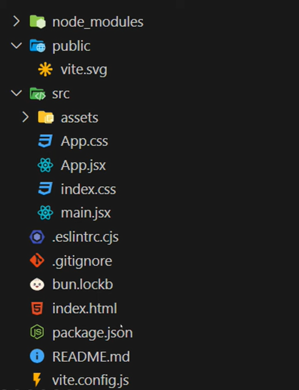

# Prerequisites before learning React
- There are some things you should know before jumping to learn React, because you will not understand what is happening when writing code if you have not learned those prerequisites.

### Building blocks for Frontend:
- HTML - to give web page a structure.
- CSS - to decorate or style web page.
- JavaScript - to make webpage interactive.
- ES6+ 

- these are the prerequisites you must know before learning React.

# React project structure and Naming convention
- Let's also talk about project structure and Naming convention in React

# Project Structure
- In React, you must be seeing this 

- this is your project structure, where different files are stored in different directories, let understand those built-in or default directories that React gives.

- node_modules: contains all necessary libraries & dependencies by React.js, you can ignore this directory.

- public: contains all static files like images, videos, fonts, etc.

- src: contains all source files of your code, it may be components, css, etc.
    - App.jsx: it is your app component(or main component) where you keep other components inside it, REMEMBER you don't have to write HTML in App.jsx, keep only components, and in React we don't create file with .html extension we create file with .jsx extension.
    - App.css: it is a css stylesheet for App component
    - main.jsx: it is entry point of our ReactJS project, it renders App component.
    - index.css: it is a global css stylesheet, changes here will reflect globally.
    - assets: it contains your components or pages of your website.

- .eslintrc.cjs: contains configuration for ESLint (analyses the problematic patterns in your code), you can ignore it.

- .gitignore: contains files that we have to ignore while pushing into git repository, you have to study git and github version control to understand better.

- index.html: serves as entry point for the web browser, as it contains div element with id 'root' which is connected to main.jsx and renders all the components inside App.jsx.

- package.json: contains all the details about your project. It includes name, version, description, scripts, dependencies.

- Now, Let's understand some Naming convention: you are not just learning this cases for React only, but it also helps in programming languages, so remember it once you have learned.

- PascalCase: In react we use it for components, and for programming languages we use it for classes.

- camelCase: We use it for functions in both React and programming languages.

- kabab-case: It is used for files, css classe, id, etc.

- snake_case: It is used for variables and objects

- UPPERCASE: Not used in React, but in programming languages we use this case for constant values(values that doesn't change). for e.g. PI = 3.14